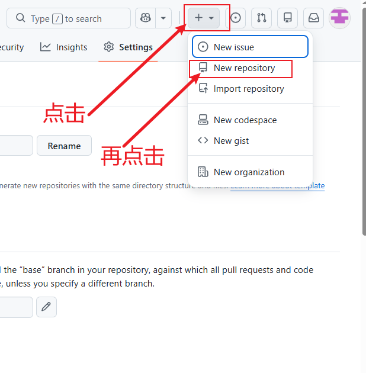
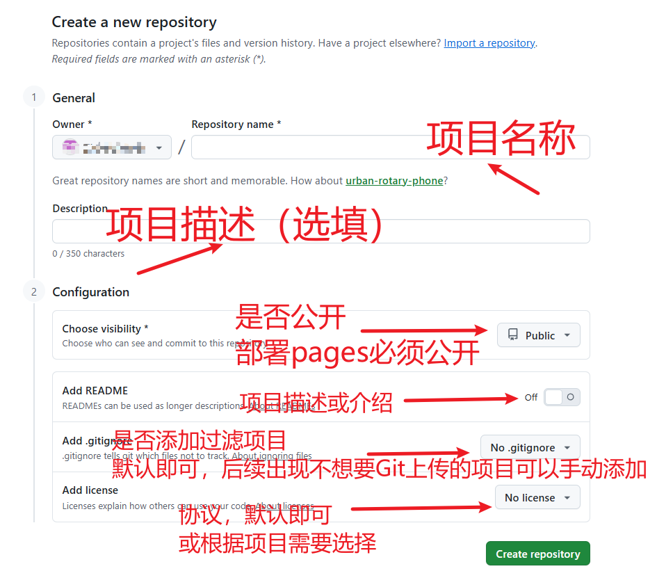

# Docsify入门学习笔记

## 主题样板分析

```html
<!DOCTYPE html>
<html lang="en">
<head>
    <meta charset="UTF-8">
    <meta http-equiv="X-UA-Compatible" content="IE=edge,chrome=1"/>
    <meta name="viewport" content="width=device-width, initial-scale=1.0, minimum-scale=1.0">
    <!-- 官网标题 -->
    <title>至流云</title>
    <!-- 网站描述 -->
    <meta name="description" content="基于flink打造超轻量级大数据平台">
    <!-- seo关键字 -->
    <meta name="keywords" content="flink,flink-yun,至流云">
    <!-- 修改项目icon -->
    <link rel="icon" href="https://img.isxcode.com/isxcode_img/isxcode/flink-yun%28%E5%B7%B2%E5%8E%BB%E5%BA%95%29.jpg">
    <!-- 选择默认主题，任意选择一个 -->
    <link rel="stylesheet" href="//cdn.jsdelivr.net/npm/docsify@4/lib/themes/vue.css">
    <!-- <link rel="stylesheet" href="//cdn.jsdelivr.net/npm/docsify/themes/vue.css" />
    <link rel="stylesheet" href="//cdn.jsdelivr.net/npm/docsify/themes/buble.css" />
    <link rel="stylesheet" href="//cdn.jsdelivr.net/npm/docsify/themes/dark.css" />
    <link rel="stylesheet" href="//cdn.jsdelivr.net/npm/docsify/themes/pure.css" />
    <link rel="stylesheet" href="https://cdn.jsdelivr.net/npm/docsify-themeable@0/dist/css/theme-simple.css">
    <link rel="stylesheet" href="https://cdn.jsdelivr.net/npm/docsify-themeable@0/dist/css/theme-defaults.css">
    <link rel="stylesheet" href="https://cdn.jsdelivr.net/npm/docsify-themeable@0/dist/css/theme-simple-dark.css"> -->
    <!-- 自定义样式，推荐样式 https://github.com/Netflix/pollyjs/blob/master/docs/assets/styles.css  -->
    <link rel="stylesheet" href="assets/styles.css" />
    <!-- 在线编辑 -->
    <script src="//cdn.jsdelivr.net/npm/docsify-edit-on-github"></script>
</head>
<body>
<!-- 加载样式 -->
<div id="app">
    Please wait...
</div>
<script>
    window.$docsify = {
        // 配置项目名称
        name: '至流云',
        // 点击名称跳转
        nameLink: '/',
        // 主题色
        themeColor: '#b064c0',
        // logo
        logo: 'https://img.isxcode.com/isxcode_img/isxcode/flink-yun%28%E5%B7%B2%E5%8E%BB%E5%BA%95%29.jpg',
        // 路由地址
        alias: {
            '.*/_sidebar.md': '/zh-cn/_sidebar.md',
            '.*/_navbar.md': '/zh-cn/_navbar.md',
        },
        // 加载侧边栏
        loadSidebar: true,
        // 加载nav栏
        loadNavbar: true,
        // 显示首页，需要配置_coverpage.md文件，参考 https://github.com/Netflix/pollyjs/blob/master/docs/_coverpage.md
        coverpage: true,
        // 最大子层级
        subMaxLevel: 3,
        // 最大父层级
        maxLevel: 3,
        // 路由模式 hash或者history
        routerMode: 'history',
        // 自动回到顶部
        auto2top: true,
        // 自动显示header
        autoHeader: false,
        // 首页不可滚动
        onlyCover: true,
        // 配置readme文件
        homepage: '_homepage.md',
        // 配置404页面, 需要配置 _404.md
        notFoundPage: true,
        // 仓库地址
        repo: '',
        // 配置插件
        plugins: [
            // 在线编辑
            EditOnGithubPlugin.create('', null, 'Edit on github')
        ],
        // 全局搜索
        search: {
            placeholder: '搜索',
            noData: '暂无结果',
            namespace: '/zh-cn/',
            hideOtherSidebarContent: true,
        },
        // 拷贝代码
        copyCode: {
            buttonText: 'Copy to clipboard',
            errorText: 'Error',
            successText: 'Copied'
        },
        // 上一页/下一页
        pagination: {
            previousText: 'PREVIOUS',
            nextText: 'NEXT',
            crossChapter: true,
            crossChapterText: true,
        },

    }
</script>
<!-- Docsify v4 -->
<script src="//cdn.jsdelivr.net/npm/docsify@4"></script>
<!-- 全局搜索 -->
<script src="//cdn.jsdelivr.net/npm/docsify/lib/plugins/search.min.js"></script>
<!-- 上一页/下一页 -->
<script src="//cdn.jsdelivr.net/npm/docsify-pagination/dist/docsify-pagination.min.js"></script>
<!-- 代码拷贝 -->
<script src="//cdn.jsdelivr.net/npm/docsify-copy-code"></script>
<!-- 图片放大缩小 -->
<script src="//cdn.jsdelivr.net/npm/docsify/lib/plugins/zoom-image.min.js"></script>

<!-- 代码块代码 -->
<script src="//cdn.jsdelivr.net/npm/prismjs/components/prism-bash.min.js"></script>
<script src="//cdn.jsdelivr.net/npm/prismjs/components/prism-java.min.js"></script>
<script src="//cdn.jsdelivr.net/npm/prismjs/components/prism-json.min.js"></script>
<script src="//cdn.jsdelivr.net/npm/prismjs/components/prism-yaml.min.js"></script>
<script src="//cdn.jsdelivr.net/npm/prismjs/components/prism-http.min.js"></script>
<script src="//cdn.jsdelivr.net/npm/prismjs/components/prism-sql.min.js"></script>
<script src="//cdn.jsdelivr.net/npm/prismjs/components/prism-xml-doc.min.js"></script>
<script src="//cdn.jsdelivr.net/npm/prismjs/components/prism-groovy.min.js"></script>

</body>
</html>
```


## 集成现成插件大全

1. docsify 主题 <br>
> https://jhildenbiddle.github.io/docsify-themeable/#/themes

```css
<link rel="stylesheet" href="https://cdn.jsdelivr.net/npm/docsify-themeable@0/dist/css/theme-simple-dark.css">
<link rel="stylesheet" href="https://cdn.jsdelivr.net/npm/docsify-themeable@0/dist/css/theme-simple.css">
<link rel="stylesheet" href="https://cdn.jsdelivr.net/npm/docsify-themeable@0/dist/css/theme-default.css">
```

2. docisfy 返回顶部 <br>
> https://github.com/Sumsung524/docsify-backTop

```js
<!-- jsDelivr -->
<script src="https://cdn.jsdelivr.net/gh/Sumsung524/docsify-backTop/dist/docsify-backTop.min.js"></script>

<!-- 本地引入 -->
<script src="js/docsify-backTop.min.js"></script>

<!-- 配置 -->                   //配置项位置需要写到jsDeliver的后面任意位置
<script>
docsifyBackTop = {
        size: 32,           	// 数值，组件大小，默认值32。
        bottom: 15,         	// 数值，组件底部偏移距离，默认值15。
        right: 15,          	// 数值，组件右侧偏移距离，默认值15。
        logo: '',	        // logo:字符串或svg矢量图代码，默认为svg代码图标。
        bgColor: '\#2096ff'    	// 背景颜色，#fff、pink等，logo为svg图标时，不填。
    };
</script>
```
3. docisfy 图片缩放 <br>

```js
<!-- jsDelivr -->
<script src="//cdn.jsdelivr.net/npm/docsify/lib/plugins/zoom-image.min.js"></script>

<!-- 本地引入 -->
<script src="node_modules/medium-zoom/dist/medium-zoom.min.js"></script>
```

4. docsify 字数统计 <br>
> https://github.com/827652549/docsify-count

```js
<!-- jsDelivr -->
<script src="https://cdn.jsdelivr.net/npm/docsify-count@latest/dist/countable.min.js"></script>

<!-- unpkg -->
<script src="//unpkg.com/docsify-count/dist/countable.min.js"></script>

<!-- 配置-->
window.$docsify = {
  count:{
    countable: true,  // 是否启用
    position: 'top',  // 位置
    margin: '10px',   // 距离
    float: 'right',   // 浮动
    fontsize:'0.9em', // 字号
    color:'rgba(117, 92, 112, 1)',  // 颜色
    language:'chinese',       // 语言
    localization: { 
      words: "",
      minute: ""
    },
    isExpected: true    // 是否显示预计阅读时间
  }
}
```

5. docsify 代码复制 <br>
<mark>**该插件可能会与其他插件冲突,请优先放在js部分的靠前位置,否则无法生效**</mark>
> https://github.com/jperasmus/docsify-copy-code

```js
<!-- jsDelivr -->
<script src="https://cdn.jsdelivr.net/npm/docsify-copy-code@2.1.1/dist/docsify-copy-code.min.js"></script>

<!-- unpkg -->
<script src="https://unpkg.com/docsify-copy-code@2.1.1/dist/docsify-copy-code.min.js"></script>

<!-- 配置-->
window.$docsify = {
  copyCode: {
    buttonText: '复制',
    errorText: '错误',
    successText: '复制成功'
  }
}
```

6. docsify Tabs选项卡 <br>
   <mark>**该插件可能会与其他插件冲突,请优先放在js部分的靠前位置,否则无法生效**</mark>
> https://github.com/jhildenbiddle/docsify-tabs

```js
<!-- jsDelivr -->
<script src="https://cdn.jsdelivr.net/npm/docsify-tabs@1"></script>

<!-- unpkg -->
<script src="//unpkg.com/docsify-tabs/dist/docsify-tabs.min.js"></script>

<!-- 配置 -->
window.$docsify = {
  tabs: {
    persist: true,  // 是否记忆当前选项
    sync: true,     // 是否同步滚动
    theme: {        // 主题，classic为默认
      light: 'github-light',    
      dark: 'github-dark'
    },
    tabComments: false,  // 是否显示评论
    tabHeaders: false   // 是否显示标题
  }
}

<!-- 对应 Markdown语法 --> // 注意：<!-- tabs:start --><!-- tabs:end -->不能省略

<!-- tabs:start -->
#### **选项1**
内容1

#### **选项2**
内容2
<!-- tabs:end -->
```
7. docsify 文章提示Alert <br>
> https://github.com/fzankl/docsify-plugin-flexible-alerts

```js
<!-- unpkg -->
<script src="https://unpkg.com/docsify-plugin-flexible-alerts"></script>

<!-- 简要配置 --> // 具体自定义配置请查看官方文档
window.$docsify = {
    'flexible-alerts': {
        style: 'callout'
    }
}

<!-- 对应 Markdown语法 --> 

> [!TIP] 这是一个提示
> An  alert of type 'tip' using global style 'callout'

> [!IMPORTANT] 这是一个重要提示
> An  alert of type 'important' using global style 'callout'

> [!NOTE] 这是一个注意提示
> An  alert of type 'note' using global style 'callout'

> [!WARNING] 这是一个警告提示
> An  alert of type 'warning' using global style 'callout'
```

8. docsify 最近更新时间 <br>
> https://github.com/pfeak/docsify-updated

```js
<!-- jsDelivr -->
<script src="https://cdn.jsdelivr.net/npm/docsify-updated/src/time-updater.min.js"></script>

<!-- 配置 --> // 具体自定义配置请查看官方文档
window.$docsify = {
  timeUpdater: {
    text: ">最后更新时间: {docsify-updated}",  // 使用div标签可以指定样式
    formatUpdated: "{YYYY}/{MM}/{DD}",
    whereToPlace: "bottom",  // "top" or "bottom", default to "bottom"
  },
};
```

9. docsify 阅读进度条 <br>
    <mark>**该插件会与自带进度条的主题冲突,请按需使用**</mark>
> https://github.com/HerbertHe/docsify-progress

```js
<!-- jsDelivr -->
<script src="https://cdn.jsdelivr.net/npm/docsify-progress@latest/dist/progress.min.js"></script>

<!-- 配置 --> 
window.$docsify = {
    progress: {
        position: "top",
        color: "var(--theme-color,#42b983)",
        height: "3px",
    }
}
```

10. docsify 百度统计  <br>
> https://github.com/youngfish42/note/commit/4e26e94586b05e959d9b4df7923f2c14889531cd
> https://tongji.baidu.com/main/setting/10000716004/home/site/index

```js
<script>
  var _hmt = _hmt || [];
  (function () {
    var host = window.location.host;
    if(host === 'localhost' || host === '127.0.0.1')) {
      return;
    }
    var hm = document.createElement("script");
    hm.src = "https://hm.baidu.com/hm.js?填写你的钩子ID"; // 百度统计 ID
    var s = document.getElementsByTagName("script")[0];
    s.parentNode.insertBefore(hm, s);
  })();
</script>
```

11. docsify plantuml画图 <br>
> https://github.com/imyelo/docsify-plantuml
> https://plantuml.com/zh/

```js
<!-- unpkg -->
<script src="//unpkg.com/docsify-plantuml/dist/docsify-plantuml.min.js"></script>

<!-- 配置 --> // 具体自定义配置请查看官方文档
<script>
window.$docsify = {
  plantuml: {
    skin: 'default',
  },
}
</script>

<!-- 对应 Markdown语法 --> 
// 语法浏览：https://plantuml.com/zh/
```

12. docsify Toc插件 <br>
> https://github.com/justintien/docsify-plugin-toc

```js
<!-- head -->
<link rel="stylesheet" href="https://unpkg.com/docsify-plugin-toc@1.3.1/dist/light.css">
<!-- Also insert you custom css -->

<!-- body -->
<script src="https://unpkg.com/docsify-plugin-toc@1.3.1/dist/docsify-plugin-toc.min.js"></script>

<!-- 配置 --> 
<script>
window.$docsify = {
  toc: {
    tocMaxLevel: 5,
    target: 'h2, h3, h4, h5, h6',
    ignoreHeaders:  ['<!-- {docsify-ignore} -->', '<!-- {docsify-ignore-all} -->']
  },
}
</script>
```

13. docsify 手风琴 <br>
> https://github.com/isaozler/docsify-accordion

```js
<!-- head -->
<link rel="stylesheet" href="https://cdn.jsdelivr.net/npm/docsify-accordion/src/style.css">

<!-- body -->
<script src="https://cdn.jsdelivr.net/npm/docsify-accordion/src/index.js"></script>

<!-- 对应 Markdown语法 -->
+ 问题1? +
// 此处空行不能省略
答案1

+ 问题2? +
// 此处空行不能省略
答案2
```

14. docsify 全文搜索 <br>
> https://docsify.js.org/#/zh-cn/plugins

```js
<!-- jsDelivr -->
<script src="https://cdn.jsdelivr.net/npm/docsify/lib/plugins/search.min.js"></script>

<!-- 配置 --> // 具体自定义配置请查看官方文档
search: 'auto', 
```

15. docsify 基于GitHub显示文件共享者 <br>
```js
<!-- jsDelivr -->
<script src="https://gcore.jsdelivr.net/npm/docsify-contributors@latest/dist/index.min.js"></script>

<!-- 配置 -->
<script>
window.$docsify = {
    contributors: {
        repo: 'https://github.com/youngfish42/note',
        ignores: []
        style: {
            color: '#42b983',
            bgcolor: '#0a192f'
        },image: {
            size: 40,
            isRound: true,
            margin: '0.5em'
        },load: {
            isOpen: true,
            color: '#42b983'
        }
    }
}
</script>
```

16.  docsify 在线笔记转PDF <br>
> https://github.com/meff34/docsify-to-pdf-converter

> [!TIP] 需要Node.js环境
> [详情请查看官方文档](https://github.com/meff34/docsify-to-pdf-converter)

17. docsify PDF预览 <br>
> https://github.com/lazypanda10117/docsify-pdf-embed

```js
<!-- jsDelivr -->
  <script src="//gcore.jsdelivr.net/npm/pdfobject@2.2.8/pdfobject.min.js"></script>
  
  <script src="//gcore.jsdelivr.net/npm/docsify-pdf-embed-plugin/src/docsify-pdf-embed.js"></script>

<!-- 配置 --> 
<script>
window.$docsify = {
markdown: {
        renderer: {
           code: function(code, lang) {
               if(lang === 'pdf'){
                var renderer_func = function(code, lang, base=null) { 
	var pdf_renderer = function(code, lang, verify) {
		function unique_id_generator(){
			function rand_gen(){
				return Math.floor((Math.random()+1) * 65536).toString(16).substring(1);
			}
			return rand_gen() + rand_gen() + '-' + rand_gen() + '-' + rand_gen() + '-' + rand_gen() + '-' + rand_gen() + rand_gen() + rand_gen();
		}
		if(lang && !lang.localeCompare('pdf', 'en', {sensitivity: 'base'})){
			if(verify){
				return true;
			}else{
				var divId = "markdown_code_pdf_container_" + unique_id_generator().toString();
				var container_list = new Array();
				if(localStorage.getItem('pdf_container_list')){
					container_list = JSON.parse(localStorage.getItem('pdf_container_list'));	
				}
				container_list.push({"pdf_location": code, "div_id": divId});
				localStorage.setItem('pdf_container_list', JSON.stringify(container_list));
				return (
					'<div style="margin-top:'+ PDF_MARGIN_TOP +'; margin-bottom:'+ PDF_MARGIN_BOTTOM +';" id="'+ divId +'">'
						+ '<a href="'+ code + '"> Link </a> to ' + code +
					'</div>'
				);
			} 
		}
		return false;
	}
	if(pdf_renderer(code, lang, true)){
	   return pdf_renderer(code, lang, false);
	}
	return (base ? base : this.origin.code.apply(this, arguments));
                    }
               }
           }
        }
    }
}
</script>
```

18. docsify 明暗主题切换 <br>
> https://github.com/markz-demo/docsify-dark-switch

```js
<!-- head -->
<!-- 主题可根据自己喜好选择，进行替换  -->
<link rel="stylesheet" title="light" href="//cdn.jsdelivr.net/npm/docsify/themes/vue.css">
<link rel="stylesheet" title="dark" href="//cdn.jsdelivr.net/npm/docsify/themes/dark.css">

<!-- 切换核心样式  -->
<link rel="stylesheet" href="//cdn.jsdelivr.net/npm/docsify-dark-switch/dist/docsify-dark-switch.css">

<!-- body -->
<!-- jsDelivr  -->
<script src="//cdn.jsdelivr.net/npm/docsify-dark-switch/dist/docsify-dark-switch.min.js"></script>


<!-- 配置 -->
<script>
window.$docsify = {
    darkSwitch: {
        fixed: false, // 是否固定在顶部
        debug: false, // 是否开启调试模式
        style: {
            top: '25px',
            right: '60px'
        }
    },
}
</script>
```

19. docsify 文档分页 <br>
> https://github.com/imyelo/docsify-pagination?tab=readme-ov-file#readme

```js
<!-- jsDelivr -->
<script src="//unpkg.com/docsify-pagination/dist/docsify-pagination.min.js"></script>

<!-- 配置 -->
window.$docsify = {
  pagination: {
    previousText: '上一章节', // 上一章节
    // or
    nextText: {             // 下一章节
      '/en/': 'NEXT',
      '/': '下一章节'
    },
    crossChapter: true,     // 是否跨章节
    crossChapterText: true, // 显示跨章节文本
  },
}
```

## 部署上线

1. 这里选择部署到 GitHub Pages进行托管 <br>
   
2. 省略Github账号注册过程，**推荐加速器：Steam++**
   
3. 登入Github后，点击右上角 + 号，点击注册一个新仓库 <br>
   
    <br>

4. 填写相关信息，完成新建仓库 <br>
   
    <br>

5. 将docsify生成的文件上传到仓库中 <br>
