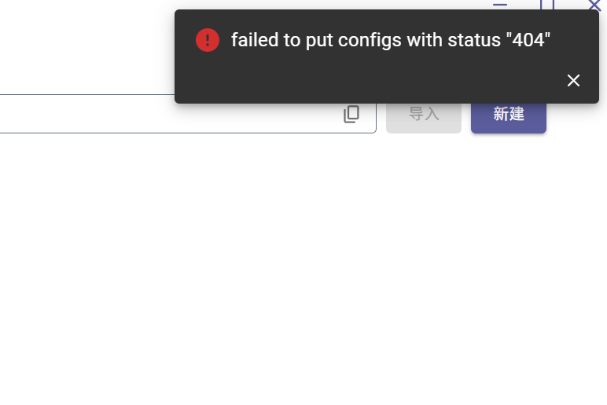
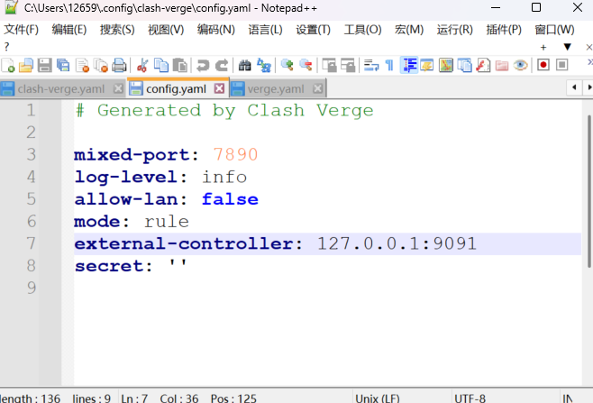
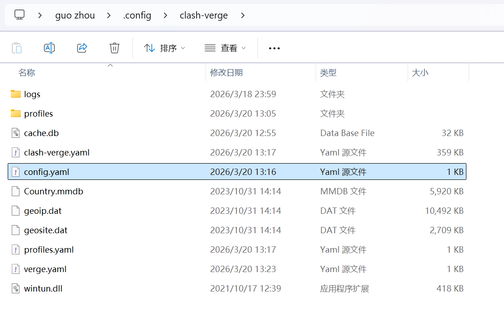
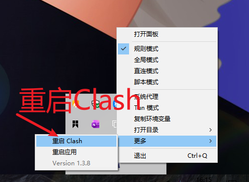

## Clash Verge 报错 failed to put configs with status 404

### 一、摘要

Clash Verge 启动配置报错 failed to put configs with status 404？本文带你一步步排查端口占用问题，并提供两种无痛解决方案，让你快速恢复代理功能。

### 二、问题背景

在使用Clash Verge的过程中，切换配置报错：

> failed to put configs with status 404

导致配置无法推送、代理功能失效。

### 三、问题定位

1. 端口占用检查  
  - 按下 **Win+R** 输入cmd
  - 在打开的窗口内输入命令
  > netstat -ano | findstr :9090

 <mark>clash verge的配置文件默认监听端口为9090</mark>

结果：
（1）无输出：代表该端口未被使用
（2）有输出：代表该端口已被占用,结果类似：
> TCP &nbsp;&nbsp; 0.0.0.0:9090 &nbsp;&nbsp; 0.0.0.0:0 &nbsp;&nbsp; LISTENING &nbsp;&nbsp; 8680
> TCP &nbsp;&nbsp; [::]:9090 &nbsp;&nbsp; [::]:0 &nbsp;&nbsp; LISTENING &nbsp;&nbsp; 8680

1. 进程归属确认  
- 在命令窗口内进一步查询端口的进程信息
> tasklist | findstr 8680

- 结果显示：占用9090端口的是java.exe进程，结果类似：

  > java.exe &nbsp;&nbsp; 8680 Services &nbsp;&nbsp; 0 &nbsp;&nbsp; 162,148,K

3. 根本原因分析  
  
当我们进行查看Clash Verge 配置文件中设置了外部控制器端口时，我们能够观测到这行配置命令：
    > external-controller: 127.0.0.1:9090

> [!NOTE]
> 我这里已经修改为9091（正常打开这里显示9090）**该9090端口被本地 Java 服务占用，导致 Clash 内核无法绑定端口，前端 API 请求无法访问内核，最终返回 404 错误。**

### 四、无痛解决方案

#### 方案一：修改 Clash Verge 外部控制器端口（推荐）

1. 打开Clash Verge -> 设置 -> 点击应用目录  
 

2. 在目录页点击Config.yaml使用记事本打开  
 

3. 修改9090为9091或其它未占用的端口  
 

4. 保存文件并重启Clash Verge  
 

#### 方案二：修改Java服务端口

若需保留 Clash Verge 9090 端口，可调整 Java 服务端口：
1. 找到 Java 项目配置文件（application.properties 或 application.yml）
2. 修改9090端口为其他未被占用的端口：
   
    > application.properties：
    > server.port=9091

    > application.yml：
    > server:
    > &nbsp;&nbsp; port: 9091
3. 重启 Java 服务，释放 9090 端口，Clash Verge 即可正常绑定端口。

### 五、补充说明 

- **核心原因：** 
  Clash Verge 外部控制器端口与本地潜在服务端口冲突，导致内核无法启动。
- **解决查看：** 
  查看端口，根据端口所示进程PID，查询PID服务，确认是否是Clash Verge进程。保证 Clash Verge 前端与内核端口一致，避免与其他服务端口占用。
- **解决方案：**
  优先修改 Clash Verge 端口，避免影响正在运行的业务服务。

- **常用命令**
  - **查看端口占用**
  > netstat -ano | findstr :<端口号>
  - **查看进程归属**
  > tasklist | findstr \<PID>
  - **强制结束进程**
  > taskkill /PID \<PID> /F

