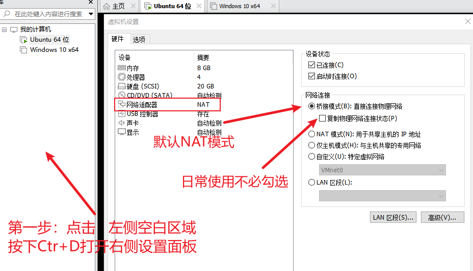

# Ubuntu网络适配器之如何配置桥接模式

## VMware网络模式简介

1. NAT模式 <br>
  - **原理**：虚拟机通过宿主机的 IP 地址共享上网，VMware 会虚拟出一个 NAT 网关。 <br>
  - **优点**：方便，不需要额外的配置。虚拟机直接通过宿主机的 IP 地址共享上网，VMware 会虚拟出一个 NAT 网关。 <br>
  - **特点**：
     - 虚拟机可访问宿主机、外网，但宿主机无法访问虚拟机，同时外网无法主动访问虚拟机。
     - 不占用宿主机的物理网络IP，避免IP冲突。
     - 宿主机可通过端口映射访问虚拟机内的服务。   
<br>

1. Bridged模式（桥接模式） <br>
  - **原理**：虚拟机直接连接到物理网络，相当于局域网内一台独立的物理主机。 <br>
  - **优点**：与宿主机在同一网段，由物理网络的 DHCP 服务器分配（或手动配置）。 <br>
  - **特点**：
     -  虚拟机与宿主机、局域网内其他设备完全互通。
     - 虚拟机可直接访问外网，也可被外网设备访问（需路由器端口映射）。
     -  会占用物理网络的 IP 地址，可能造成 IP 冲突。   
<br>
   
+ 复制物理网络连接状态是否要勾选？ +
  
  这个选项仅在桥接模式下生效，核心作用是让虚拟机 “继承” 宿主机的网络连接状态，**勾选后：虚拟机的网络适配器会模拟宿主机网卡的连接状态（比如宿主机网线断开、WiFi 切换时，虚拟机也会同步感知到网络断开 / 重连）。**需要模拟真实物理机网络行为时，建议勾选。日常使用不需要勾选。

3. Host-only模式（主机模式） <br>
  - **原理**：虚拟机与宿主机组成一个封闭的虚拟局域网，与外部物理网络完全隔离。 <br>
  - **优点**：在 VMware 专属的仅主机网段（如 172.16.x.x），由 VMware DHCP 分配。<br>
  - **特点**：
     - 虚拟机与宿主机之间完全互通。
     - 虚拟机无法访问外网，也无法被外网访问，安全性最高。
<br>

4. LAN区段模式（局域网模式） <br>
  - **原理**：创建一个完全隔离的虚拟局域网，仅在同一虚拟机组内互通。
 <br>
  - **优点**：适合进行极高隔离度的安全测试、病毒分析等。<br>
  - **特点**：与宿主机、外部网络完全隔离，甚至不同 LAN 区段之间也无法通信。
<br>

## Ubuntu配置桥接模式

1. 查看宿主机的网络连接状态：**Win + R** 输入cmd<br>
  - 在打开的窗口内输入ipconfig 并回车，找到你当前正在使用的网卡（有线以太网或无线 WLAN）：
    - IPv4 地址：例如 192.168.3.105
    - 子网掩码：例如 255.255.255.0
    - 默认网关：例如 192.168.3.1
    - DNS 服务器：例如 114.114.114.114 或路由器地址

2. 进入虚拟机设置界面，点击网络选项卡，点击适配器选项卡，选择桥接模式<br>
   <br>

3. 进入虚拟机，按住 Ctrl + ALT + T 进入终端，输入命令：<br>
  ```bash
  // 切换到root用户
  sudo -i  

  // 查看网卡名称（一般为ens33）
  ip a
  
  // 两种方法配置IP
  //方法一：自动获取IP
  dhclient -r  # 移除当前IP
  dhclient     # 重新自动获取IP
  ping baidu.com  # 检查是否可以访问外网,收到数据包即可
  
  //方法二：手动配置IP
  vi /etc/netplan/01-network-manager-all.yaml
  ```
 我在使用Vim编辑器出现如下情况：<br>
    1. 在编辑模式下使用方向键的时候，并不会使光标移动，而是在命令行中出现A、B、C、D四个字母；
    2. 当编辑出现错误，想要删除时，发现Backspace键不起作用，只能用Delete键来删除； <br>
   分别执行如下命令即可正常使用
> sudo apt-get remove vim-common <br>
> sudo apt-get install vim

  ``` bash
  //  进入配置编辑页,示例：
 network:
  version: 2
  renderer: NetworkManager
  ethernets:
    ens33:  # 你的网卡名，用 ip a 查看
      addresses: [192.168.3.200/24]  # IP(2~254中选择一个即可，避开已使用的IP)
      gateway4: 192.168.3.1  # 网关
      nameservers:
        addresses: [192.168.3.1, 114.114.114.114]  # DNS
                  // 可以使用华农DNS地址：[202.96.134.133,8.8.8.8]

  // 保存配置文件 :wq 或 :w !sudo tee % 然后执行以下命令
  sudo netplan apply

  // 查看连接状态
  ping 192.168.3.1 或 ping baidu.com
  ```
4. 收到数据包证明你的桥接模式已经成功设置！