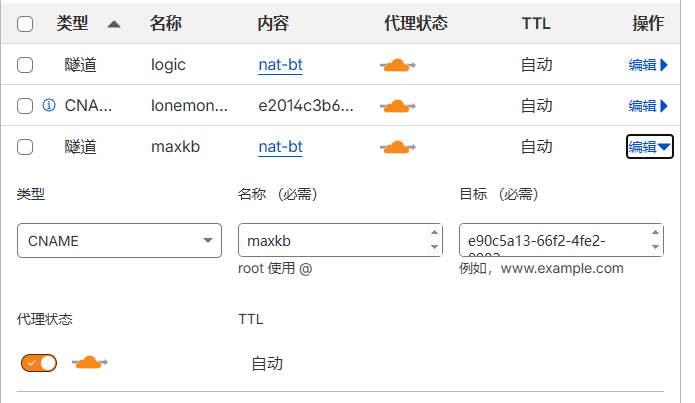

# Nat机无独立IP、无法做建站转发处理方案记录

最近买了个云服务器（Ubuntu系统），通过docker部署了项目，但买的Nat机无法做建站转发，80和443端口无法使用，公网访问服务只能通过外部IP+端口的方式，考虑到暴露源IP可能造成安全风险，所以想通过二级域名访问站点，一开始使用 CF workers路由，出现 `error code: 1003`，核心原因是 Cloudflare 不允许 Workers 直接代理带**非标准端口的 IP 地址**，被 Cloudflare 安全策略拦截。同时触发状态码：`503`，服务器也不响应所有转发的请求，所以让我们一开始排除 CF workers路由转发方案。**那宝塔面板反向代理呢**？我们可以验证一下。

```bash
# 先安装宝塔面板  
wget -O install.sh https://download.bt.cn/install/install_panel.sh && bash install.sh
```
启动宝塔面板后大家可以自己尝试一下反代，不是很难，我说一下我最后的情况，当然啦，失败了，无法访问，页面空白。原因是因为宝塔做反向代理，它需要服务器的 80（HTTP）/443（HTTPS）端口能被公网访问。Nginx 默认就是监听这两个端口，用户的域名请求要先到这两个端口，再被转发到你本地的项目实际监听端口。而我的80和443端口无法使用，那真没招了吗？我找到了这么一套方案 `Cloudflare Tunnel` ，通过隧道方式自动转发到本地回环IP，从而实现隐藏IP，外网无法扫描，只允许二级域名访问，以及内部本地回环，进入正题。

## 一、安装 Cloudflare Tunnel

### 1. 安装 Cloudflare Tunnel 客户端

```bash
# wget工具获取源码下载；-q:静默模式
wget -q https://github.com/cloudflare/cloudflared/releases/latest/download/cloudflared-linux-amd64.deb

# dpkg -i 安装软件包
sudo dpkg -i cloudflared-linux-amd64.deb

# 测试是否联通，执行命令后会输出链接，复制链接到浏览器打开授权CF账号绑定一级域名
cloudflared tunnel login

# 拓展 dpkg -r cloudflared-linux-amd64.deb  卸载(保留配置文件);
# dpkg -P cloudflared-linux-amd64.deb       完全卸载(删除配置文件);
# dpkg -l                                   列出已安装的软件包;
# dpkg -L cloudflared-linux-amd64.deb       列出包含的文件;
# dpkg -s cloudflared-linux-amd64.deb       查询指定软件包信息;
```

### 2. 创建隧道

```bash
# 创建隧道随便取个名字比如 nat-bt
cloudflared tunnel create nat-bt

# 执行完会输出一串UUID，请记住后续会用
```

### 3. 绑定子域名指向本地项目
例如：图床项目 logic.lonemonk.xyz → 本地 127.0.0.1:3030

```bash
cloudflared tunnel route dns nat-bt logic.lonemonk.xyz
```

看看是否添加成功，回到CF面板进入所绑定域名的DNS记录页<br>
  <br>

> [!NOTE]
> nat-bt是隧道名，自动添加 <br>
> 类型为CNAME，名称为logic，则子域名自动为logic.lonemonk.xyz，目标为UUID.com（一个隧道此值均相同）
> 所以我们每次在此隧道内想增加项目，则再执行`cloudflared tunnel route dns nat-bt 子域名`

### 4. 临时运行测试

```bash
cloudflared tunnel run nat-bt
```
保持终端浏览器进行访问子域名地址，正常能打开则继续进行下一步，不正常查看输出报错，测试本地回环IP
```bash
curl 127.0.0.1:3030
```
200ok正常访问，否则报错，监听端口错误等等，可继续查看报错信息。由于我是docker部署项目，我只提供我的方案
```bash
# 1.创建配置文件文件夹
mkdir -p /etc/cloudflared

# 2.创建配置文件
nano /etc/cloudflared/config.yaml

# 3.配置文件内容
tunnel: e90c5a13...(自己的UUID填写完整)
credentials-file: /root/.cloudflared/e90c5a13...(自己的UUID填写完整).json

ingress:
  - hostname: logic.lonemonk.xyz
    service: http://127.0.0.1:3030
 # 新增项目在这里添加
  - service: http_status:404
```
按`Ctrl + O`保存，然后`Ctrl + X`退出。
```bash
# 4.启动隧道
cloudflared tunnel run nat-bt
```
启动后输出无警告报错，可以浏览器重新访问了，成功再进行下一步。
### 5. 开机自启动

```bash
# 1.创建系统服务文件
nano /etc/systemd/system/cloudflared.service

# 2.配置文件内容
[Unit]
Description=Cloudflare Tunnel Service
After=network.target

[Service]
Type=simple
ExecStart=/usr/local/bin/cloudflared tunnel --config /etc/cloudflared/config.yaml run
Restart=always
RestartSec=5
User=root

[Install]
WantedBy=multi-user.target
```
按`Ctrl + O`保存，然后`Ctrl + X`退出。
```bash
# 3.启动服务，后续修改配置文件，都要重新执行这三条命令
systemctl daemon-reload
systemctl enable cloudflared
systemctl start cloudflared
```
查看是否正常运行
```bash
systemctl status cloudflared
```
看到`active (running)`即可，可以进行下一步。

## 二、进阶
由于我提前docker部署好项目，`docker ps -a`可以看到监听的端口0.0.0.0:3030，全网任何人都能直接访问项目，我们需要进行修改。

### 1. 停止并删除旧容器
```bash
docker stop lopic maxkb pgsql
docker rm lopic maxkb pgsql
```
请根据自己项目修改名称，具体是执行`docker ps`看到的名称

### 2. 重新启动容器（举例）
```bash
docker run -d \
  --name lopic \
  --restart always \
  -p 127.0.0.1:3030:3030 \
  -v lopic_data:/app/data \
  leleo886/lopic:latest
```
`docker ps`验证监听端口，看到127.0.0.1:3030->3030，成功！此时可以把原本nat转发的端口删掉了

> [!WARNING]
> 以上步骤可能会造成数据库密码重置，部分容器会重置到默认密码
> 我以图床重置密码进行演示，进容器后执行`docker exec -it lopic sh`,再执行`./api --serve --resetpwd=11111111`或`./api --resetpwd=11111111`即可重置，输入`exit`退出容器

## 问题总结
**到这里就完成了，可以访问`https://logic.lonemonk.xyz`了，不再是IP+端口访问了，我的需求已经实现，希望本笔记也能为你带来思绪。然后我要提醒大家，重装 / 重建 Docker 容器会重置部分应用默认密码，MaxKB、LoPic 这类要提前记好初始密码或掌握重置方法**

> 这套方案延迟极低比公网访问多几毫秒延迟、隐藏自身IP、个人免费够用，唯一小弊端是依赖 CF 节点、拿不到真实访客 IP。