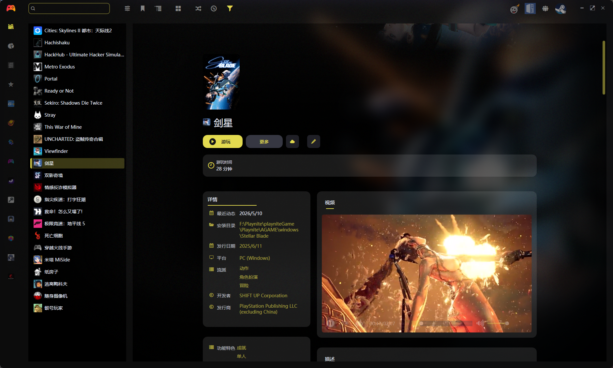

# Playnite:一款优秀的本地化游戏管理工具

## 一、软件用途

<!-- tabs:start -->
#### **多平台管理**

实现多平台游戏的管理，包括不限于**Steam、Epic、本地非正版游戏、Dlsite、Galgame、模拟器游戏**等。

#### **主机模拟**

内置Steam、Switch、Xbox等平台主题，可以进行主机模拟，市面很多售卖的游戏移动硬盘内置便是此软件。

#### **集成工具**

不仅实现游戏管理同时内置集成视频播放、修改器、存档、加速器等工具,实现游戏高度自定义的同时,增加工具的自定义。

<!-- tabs:end -->

## 二、软件下载与基本使用

- [Playnite官网](https://playnite.link/)
- [GitHub项目](https://github.com/JosefNemec/Playnite)
- [个人资源站](https://vlink.cc/lonemonk) 

推荐直接到资源站进行下载集成了很多主题与工具,官网就比较简单，不过也可以下载的。支持Windows10\11,Macos操作系统。教程很多，可以自行搜索。 
我就简单说一下我自己的使用心得,就是可以自定义工具,把游戏相关的软件全部集合起来,就不用到处找啦!直接上图,教程到此结束!

**对了,如果你想管理你的galgame,但元数据获取不全,你可以通过这篇文章去学习喔!**
友情链接：[Galgame的管理](https://zhuanlan.zhihu.com/p/1924198349478814395)